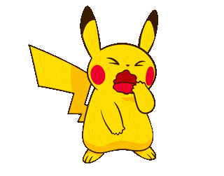

  

<h1 align="center">Hi 👋, I'm Monir Hossain Zitu</h1>

  
  
  
  

###

###

<h3 align="left">👩‍💻  About Me</h3>

###

- 🔭 I’m currently working on RoboMaster competition Club - 📚 I'm currently learning ROS - ⚡ In my free time I sleep 💤 - 📫 How to reach me : monirhoss27@gmail.com

###

<h3 align="left">🛠 Language and tools</h3>

###

  
  
  
  
  
  
  
  
  
  
  
  
  
  
  
  
  
  
  
  

###

<h3 align="left">🔥   My Stats :</h3>

###

  

###

    
  

###

 

###
